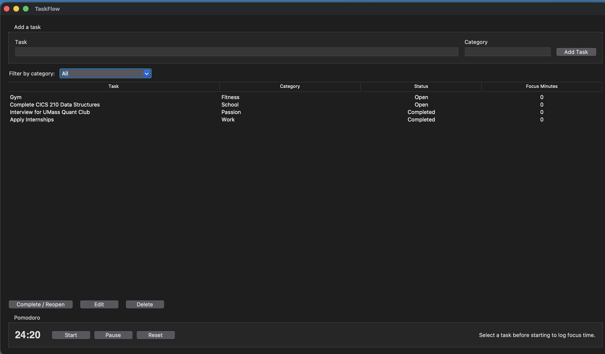

# TaskFlow

TaskFlow is a desktop productivity application built with Python, Tkinter, and SQLite. It supports task creation, editing, deletion, completion tracking, categories, filtering, persistent storage, and Pomodoro focus sessions.

## Screenshot



## Features

- Add, edit, complete/reopen, and delete tasks
- Assign tasks to categories
- Filter tasks by category
- Save data automatically in SQLite
- Reload saved tasks when the application starts
- Run a non-blocking 25-minute Pomodoro timer
- Log completed focus minutes to the selected task
- Validate user input and confirm destructive actions
- Separate the UI, business logic, model, and database layers
- Automated tests for major non-GUI features

## Project structure

```text
TaskFlow/
├── main.py             # Application entry point
├── models.py           # Task data model
├── database.py         # SQLite queries and connections
├── task_service.py     # Validation and task-management logic
├── ui.py               # Tkinter user interface and timer
├── test_taskflow.py    # Automated tests
├── .gitignore
└── README.md
```

## Run on macOS

Python 3 includes SQLite. Tkinter is included with many Python installations. Check both first:

```bash
python3 --version
python3 -m tkinter
```

The second command should open a small Tkinter test window. Close it, navigate to the project, and start TaskFlow:

```bash
cd "/Users/awalia/Desktop/TaskFlow Project"
python3 main.py
```

If the project was downloaded from GitHub instead, navigate to the downloaded folder before running `python3 main.py`.

## Run the tests

From inside the project folder:

```bash
python3 -m unittest -v
```

## How persistence works

TaskFlow creates `taskflow.db` automatically the first time it runs. The database is local to the user's computer and is intentionally excluded from GitHub so personal tasks are not published.

## Publish the source code on GitHub

### 1. Install Git if necessary

Check whether Git is installed:

```bash
git --version
```

macOS may offer to install the Command Line Tools if Git is missing. Complete that installation and rerun the command.

### 2. Create the local repository

Run these commands inside the project folder:

```bash
cd "/Users/awalia/Desktop/TaskFlow Project"
git init
git add .
git commit -m "Build TaskFlow desktop productivity application"
```

If Git asks for your identity, configure it using your real name and GitHub email:

```bash
git config --global user.name "Your Name"
git config --global user.email "your-email@example.com"
```

Then repeat the commit command.

### 3. Create the GitHub repository

1. Sign in to [GitHub](https://github.com/).
2. Select **New repository**.
3. Name it `TaskFlow`.
4. Set it to **Public** if everyone should be able to see it.
5. Do not add a README, `.gitignore`, or license on GitHub because this project already contains them.
6. Select **Create repository**.

### 4. Connect and push

GitHub will display a repository URL. Replace `YOUR-USERNAME` below with your GitHub username:

```bash
git branch -M main
git remote add origin https://github.com/YOUR-USERNAME/TaskFlow.git
git push -u origin main
```

GitHub may ask you to sign in through your browser. After the push finishes, refresh the GitHub repository page. The code and this README will be publicly visible.

## Important distinction

GitHub makes the source code visible and downloadable. It does not run Tkinter applications in a webpage. Someone who downloads the repository can run it with Python 3. A future release can package TaskFlow as a macOS `.app`, but macOS signing and distribution require additional setup.

## Architecture

- `Task` represents one task and its state.
- `TaskService` applies validation and business rules.
- `Database` owns SQLite storage and CRUD queries.
- `TaskFlowApp` displays the interface and responds to user events.
- `main.py` creates and connects these components.

This separation keeps interface code, application rules, and storage responsibilities from becoming mixed together.
